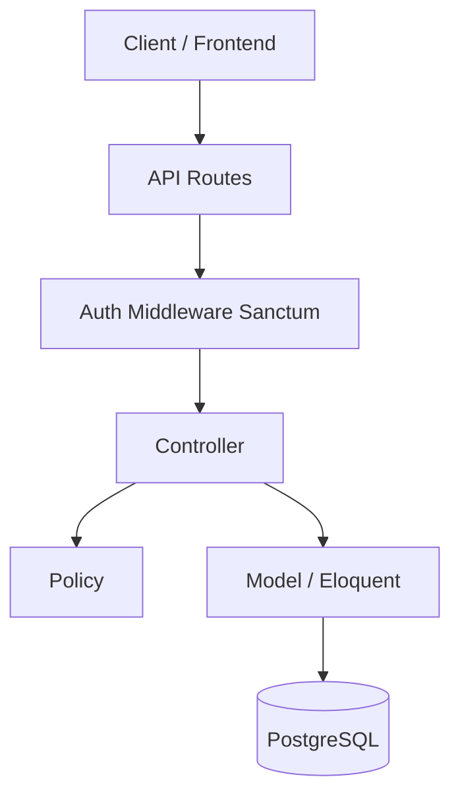

    
    
    
    
    
    

## About Taskflow Laravel

Taskflow Laravel is a task assignment API designed to coordinate and store task-related data.

It includes: 
- A token-based authentication using Laravel Sanctum;
- Endpoints to manage tasks (CRUD);
- Endpoints to manage users (CRUD);
- Login route using email and password (use the seed user credentials for first access: email->dev@email.com, password->password)
- Feature tests covering the main modules;
- API documentation generated with Scribe;

The project is covered by automated tests, includes code coverage reports, and provides a Docker-based development environment for consistency and ease of setup.

## Stack
<a href="https://laravel.com/">Laravel</a>
<a href="https://laravel.com/docs/12.x/sanctum">Sanctum</a>
<a href="https://pestphp.com">Pest</a>
<a href="https://docker.com">Docker</a>
<a href="https://github.com/knuckleswtf/scribe">Scribe</a>
<a href="https://www.postgresql.org/">PostgreSQL</a>
<a href="https://nginx.org/">Nginx</a>

## Makefile commands

Taskflow provides a Makefile with helper commands to simplify common tasks such as:

- Running the application with Docker

- Running migrations and seeders

- Rolling back migrations

- Running tests and generating coverage reports

If your Docker installation requires elevated permissions, use <b>sudo</b> before the <b>make</b> command.

Makefile command example:

`make up`

or

`sudo make up`

This command will start the Docker Compose environment.

## Running in a local environment

To run the application locally, you need:

- PostgreSQL installed and running

- A database named <b>taskflow</b>

Then run:

`php artisan migrate --seed `

Start the server:

`php artisan serve`

## API Documentation

This project uses Scribe to generate interactive API documentation.

Generate the docs:

`php artisan scribe:generate`

Access the documentation at:

`http://localhost:8000/docs`

## CI implementation

The CI pipeline is implemented using GitHub Actions and is triggered on:

- Pushes to the main branch

- Manual execution via GitHub Actions

The pipeline runs the test suite to ensure application stability and validate readiness for production deployment.

## Architecture Overview

## Future Improvements

The following features are planned for future iterations of the API:

- [ ] Create an organization module to support multi-tenant usage.
- [ ] Extend the tasks table with additional fields, such as `responsible_user(s)` and `observations`.
- [ ] Extend the users table with additional fields, such as `profile_image`, contact information, and access type.
- [ ] Create enums to manage available task statuses.
- [ ] Create enums to manage user access types and roles.
- [ ] Implement a password reset flow using email notifications.
- [ ] Implement file uploads using AWS services (e.g. S3).
- [ ] Add user registration and authentication via third-party providers (e.g. Google, Microsoft).
